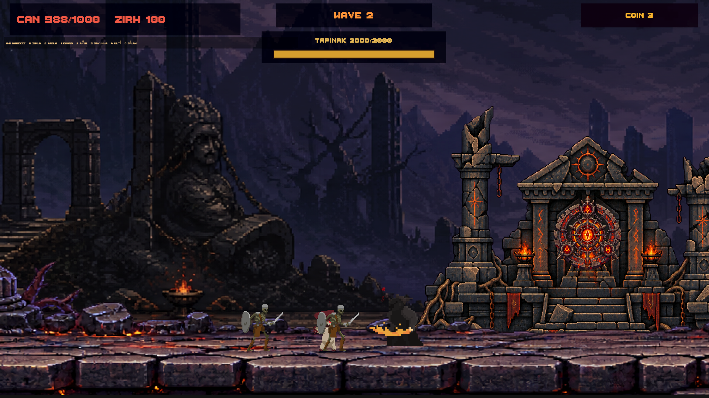
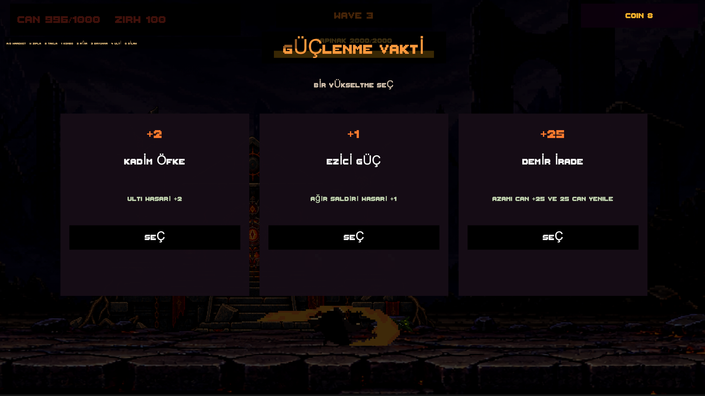
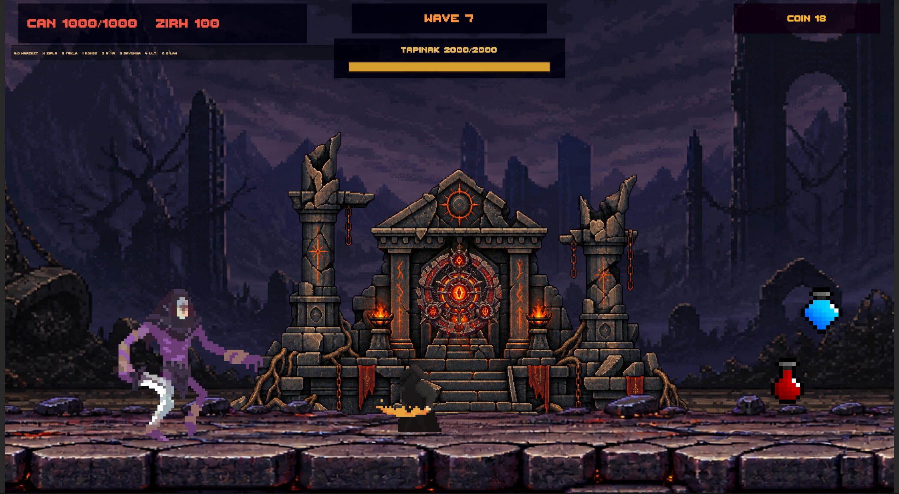
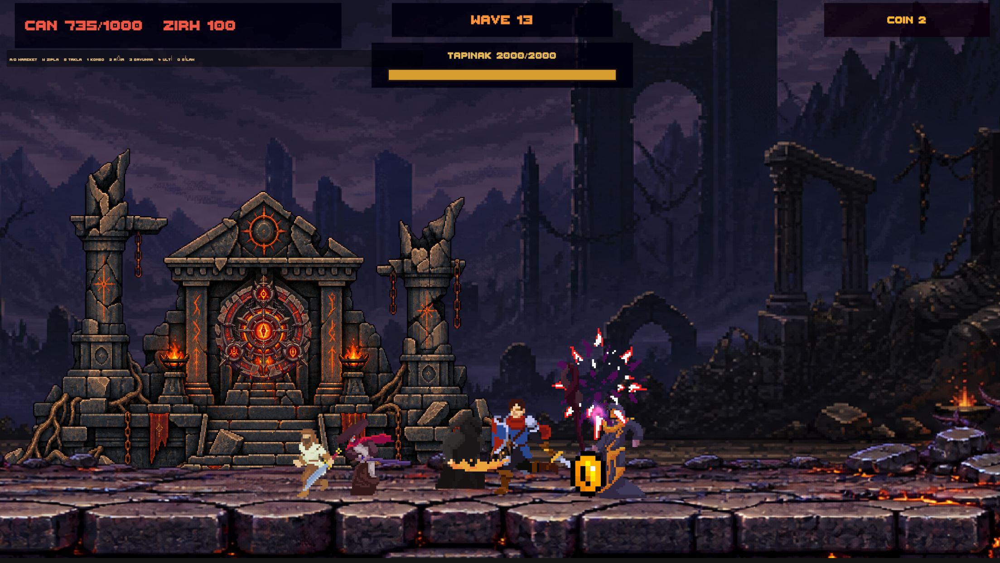
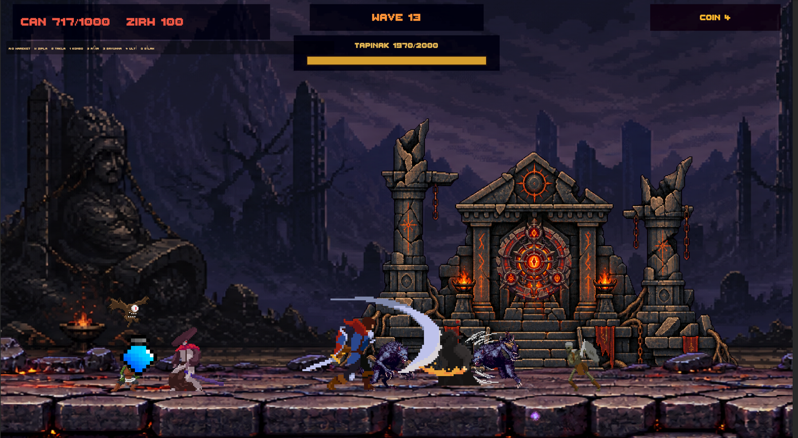
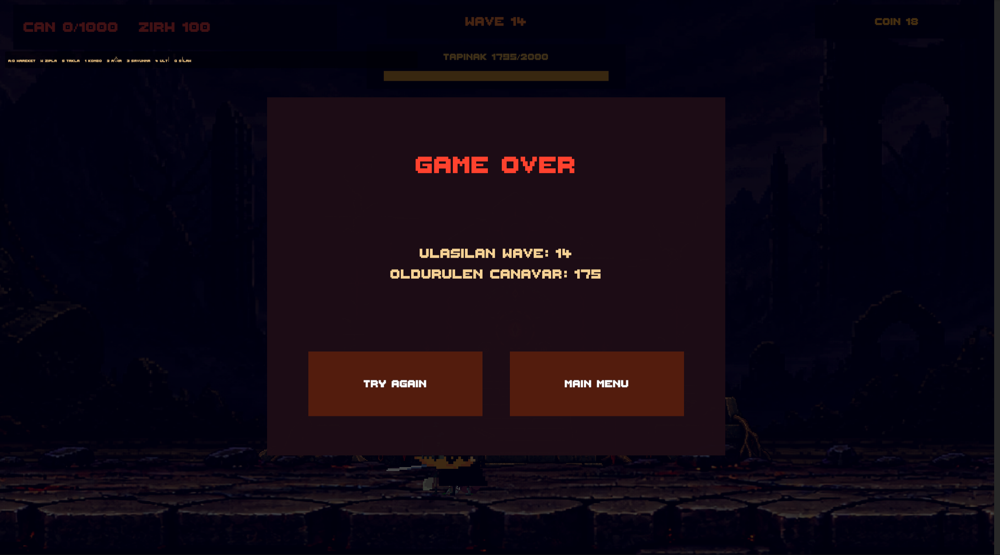

# Ancient Temple Defense

**Ancient Temple Defense** is a dark pixel-art 2D action-defense game. Protect the ancient temple against increasingly dangerous enemy waves, survive powerful bosses, collect coins, recruit allied warriors, and shape your build through periodic upgrades.

## Gameplay

- Fight escalating waves of monsters and multi-phase bosses.
- Choose a new upgrade at regular wave intervals.
- Collect coins to recruit defenders from the shop.
- Red potions restore the player; blue potions restore **50 temple health**.
- The run ends if either the player or the temple is destroyed.

## Controls

| Input | Action |
|---|---|
| **WASD** | Move, jump and roll |
| **1** | Light combo |
| **2** | Heavy attack |
| **3** | Defense |
| **4** | Ultimate attack |
| **Q** | Weapon action |

## Screenshots

### Choose Your Upgrades

### Boss Waves and Item Drops

### Recruit Allies and Defend the Temple

### Track Your Final Score

---

Built with **Unity 6**.
